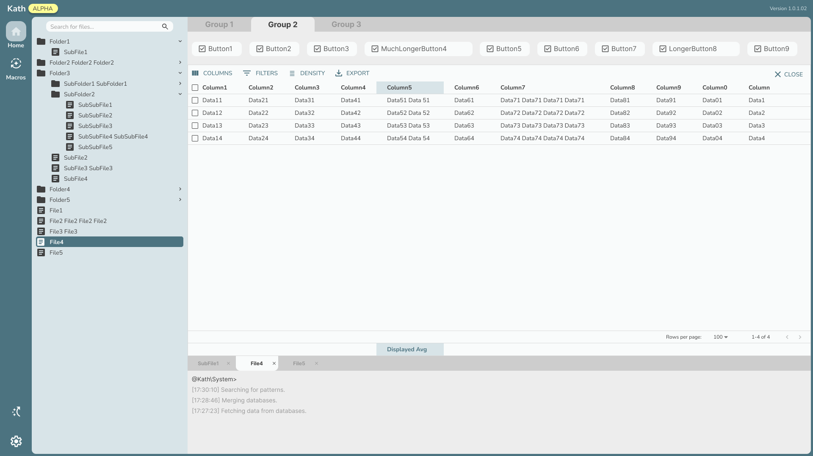
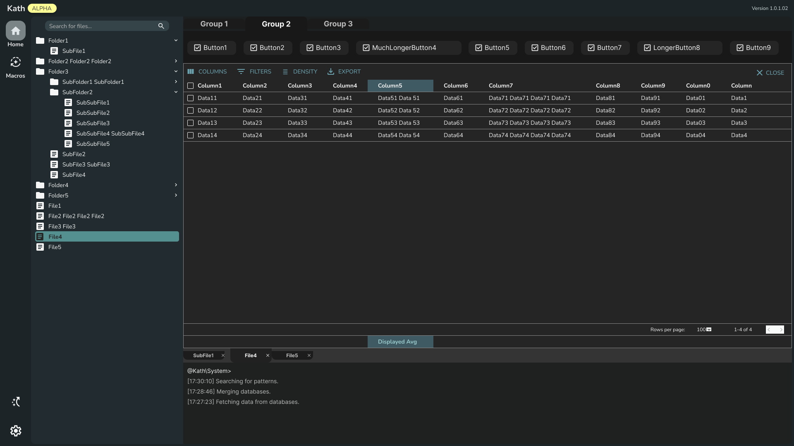
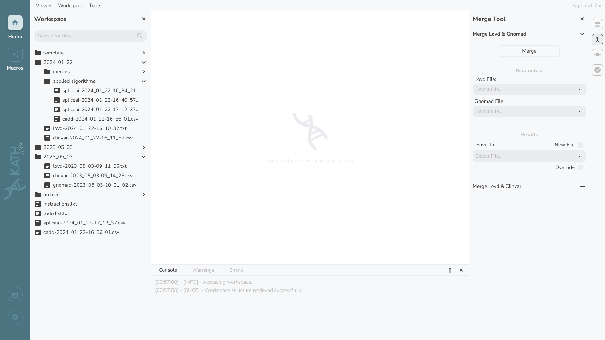
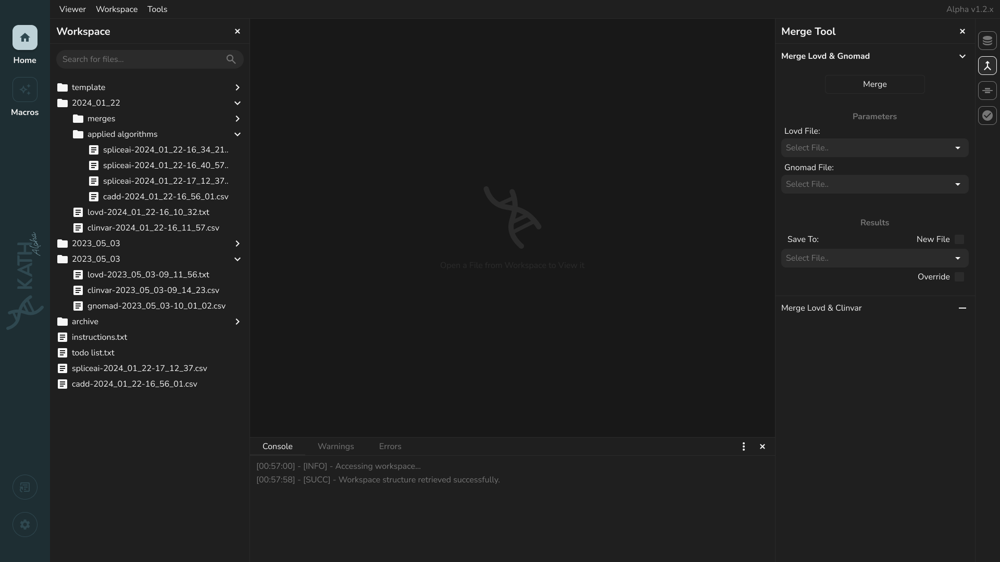

<div align="center">
  
	
</div>

---

###  Project Overview

**kath** is a user-friendly GUI tool designed for the in-depth analysis of gene variation data sourced from LOVD, GNOMAD, and CLINVAR databases. It brings together a robust suite of functionalities that facilitate genetic research and analysis.

<div align="center">
	
  
</div>

---

###  Teams Structure

####  Communications Team:

| **Team Member** | **Institution** | **Role** | **GitHub** | **LinkedIn** | **Active** |
|:-:|:-:|:-:|:-:|:-:|:-:|
| Kazimieras Bagdonas | Kaunas University of Technology | Project Mentor | - | [kazbag](https://www.linkedin.com/in/kazbag/) |  |
| Ignas Sabaliauskas | Kaunas University of Technology | Communications Lead | - | [ignas-sabaliauskas](https://www.linkedin.com/in/ignas-sabaliauskas/) |  |

####  Front End Team:

| **Team Member** | **Institution** | **Role** | **GitHub** | **LinkedIn** | **Active** |
|:-:|:-:|:-:|:-:|:-:|:-:|
| Mantvydas Deltuva | Kaunas University of Technology | Lead Frontend Developer | [mantvydasdeltuva](https://github.com/mantvydasdeltuva/) | [here](https://www.linkedin.com/in/mantvydasdeltuva/) |  |
| Justinas Teselis | Kaunas University of Technology | Frontend Developer | [justinnas](https://github.com/justinnas/) | [here](https://www.linkedin.com/in/justinasteselis/) |  |
| Paulius Preika | Kaunas University of Technology | Frontend Developer | [PauliusPreiksaCode](https://github.com/PauliusPreiksaCode) | [here](https://www.linkedin.com/in/paulius-preiksa/) |  |

####  Back End Team:

| **Team Member** | **Institution** | **Role** | **GitHub** | **LinkedIn** | **Active** |
|:-:|:-:|:-:|:-:|:-:|:-:|
| Vladyslav Levchenko | Kaunas University of Technology | Backend Developer | [Akaud](https://github.com/Akaud) | [here](https://www.linkedin.com/in/vladyslav-levchenko-409656324/) |  |
| Kajus erniauskas | Kaunas University of Technology | Backend Developer | [KajusC](https://github.com/KajusC) | [here](https://www.linkedin.com/in/kajus-%C4%8Derniauskas-a68506205/) |  |
| Nojus Sajauskas | Kaunas University of Technology | Backend Developer | [nojux-official](https://github.com/nojux-official) | [here](https://www.linkedin.com/in/nojus-sajauskas-7aa74b259/) |  |
| Yehor Nesterenko | Kaunas University of Technology | Backend Developer | - | [here](https://www.linkedin.com/in/yehor-nesterenko-20b471298/) |  |
| Marius Petrauskas | Kaunas University of Technology | Backend Developer | - | - |  |
| Ernest Tretjakov | Kaunas University of Technology | Backend Developer | - | [here](https://www.linkedin.com/in/ernest-tretjakov/) |  |
| Dainius Kirsnauskas | Kaunas University of Technology | Lead Backend Developer | [Strexas](https://github.com/Strexas) | [here](https://www.linkedin.com/in/dainius-kirsnauskas-2b8915276/) |  |

---

###  Advisors

We proudly acknowledge our advisors who contribute their expertise and resources to support kaths development:

<div align="center">
  <div>
    
    <h3><a href="https://www.harvard.edu">Harvard University</a></h3>
    <p>Leading institution in education and research.</p>
  </div>
  <div>
    
    <h3><a href="https://genomika.lt">Genomika Lietuva</a></h3>
    <p>Innovative solutions in genomics and biotechnology.</p>
  </div>
</div>

---

###  Quick Start with Docker

The easiest way to run KATH is with Docker and the provided startup script:

```bash
# Launch KATH (automatically opens browser)
./start-kath.sh

# Access the application
# Frontend: http://localhost:5173
# Backend API: http://localhost:8080
```

**All your analysis data persists automatically!** See [Data Persistence](#data-persistence) below.

---

###  Setup Instructions

For a complete setup, follow these steps and refer to the `README.md` files in `app/front_end` and `app/back_end` for detailed configurations.
**Or** read `README.md` file in `app/` for docker instructions.

1. **Clone the Repository**

    ```bash
    git clone https://github.com/your-repo/kath.git
    ```

2. **Complete Front-end and Back-end Setup**

    - Go to the `app/front_end` and `app/back_end` directories.
    - Open the `README.md` file in each directory and follow the specific installation and configuration steps provided.

After completing these steps, your environment should be set up and ready to run.

---

###  Data Persistence

KATH automatically preserves all your genetic analysis data between container restarts. Your data is stored in two persistent directories:

**Data Directory** (`./data/`)
- Contains all CSV analysis result files
- Stores CADD, SpliceAI, and other tool outputs
- ~13 MB in the provided example

**Database Directory** (`./database/`)
- SQLite database with metadata and analysis history
- File index and variant information
- Survives container deletion

#### Key Features

✅ **Automatic Data Discovery** - Previous files automatically indexed on startup
✅ **No Data Loss** - Container restart/removal doesn't affect data
✅ **Easy Backup** - Simple tar-based backup system
✅ **Cross-System** - Move data between systems with tar archives

#### Verify Data Persistence

```bash
# Check data before closing container
ls -lah data/
ls -lah database/

# Verify data survives restart
./start-kath.sh          # Stop with Ctrl+C
./start-kath.sh          # Restart - all data still there!
```

#### For Detailed Information

See [DATA_PERSISTENCE.md](DATA_PERSISTENCE.md) for:
- Complete architecture explanation
- Volume mounting details
- Backup and restore procedures
- Troubleshooting guide
- Production deployment recommendations

#### Verify Setup

```bash
# Run persistence verification
./verify-persistence.sh
```

---

###  Future Work

For the upcoming **v0.3-alpha** development, kath will undergo a comprehensive UI redesign aimed at enhancing the user experience by making the interface even more intuitive and visually engaging. This redesign will streamline navigation and improve access to its advanced tools, allowing researchers to analyze gene variation data from LOVD, GNOMAD, and CLINVAR databases with greater ease.

<div align="center">
	
  
</div>
